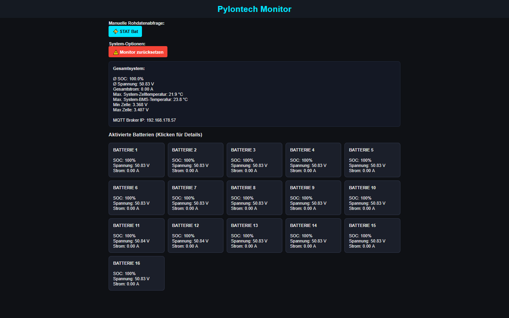

# Pylontech Monitor 2.0 (ESP32 / LilyGo T-RSS3)

Dieses Projekt ermöglicht es, Pylontech-Akkus (bis zu 16 Stück im Verbund) über die serielle Konsole (RS232) auszulesen und die Daten komfortabel per WLAN im Web-Dashboard anzuzeigen oder via MQTT an Smart-Home-Systeme (wie z.B. Home Assistant) zu übertragen.

Das Projekt basiert auf der Hardware **LilyGo T-RSS3** (ESP32-S3), welche über galvanisch isolierte RS232/RS485-Schnittstellen verfügt und somit maximale Sicherheit für deine Akkus bietet.

## 🚀 Features

- **Echtzeit-Dashboard:** Anzeige von Gesamt-SOC, Spannung, Gesamtstrom, minimaler/maximaler Zellspannung und Temperaturen.
- **Einzelbatterie-Ansicht:** Unterstützung von bis zu 16 Batterien im Verbund mit detaillierter Auflistung aller einzelnen Zellspannungen.
- **History / Status-Abfrage:** Direktes Auslesen der internen Logdaten (`stat`) des Master-Akkus (Ladezyklen, Alarme wie High Voltage etc.).
- **Smart Home Integration:** Optionale MQTT-Unterstützung zur einfachen Datenweitergabe.
- **Einfaches Setup:** Komfortables Captive-Portal zur WLAN- und MQTT-Konfiguration bei der Ersteinrichtung. Erreichbar im Netzwerk über `http://pylontech.local`.

---

## 🛠 Hardware-Anforderungen

1. **LilyGo T-RSS3** (ESP32-S3 Board mit isoliertem RS232)
2. **Eigenbau-Verbindungskabel:** RJ45-Stecker auf einen DB9-Stecker.

---

## 🔌 Kabel-Pinbelegung (RJ45 auf DB9)

Um den LilyGo T-RS3 mit dem **Konsolen-Port** der Pylontech Master-Batterie zu verbinden, musst du dir ein passendes Kabel anfertigen. Hier ist die genaue Belegung, wie sie im Projekt erfolgreich getestet wurde:

| Signal | Pylontech (RJ45 Stecker) | Standard-Farbe (T568B) | LilyGo / PC (DB9 Stecker) |
| :--- | :--- | :--- | :--- |
| **TX** (Senden) | Pin 3 | Weiß-Grün | **Pin 3** (RX) |
| **RX** (Empfangen) | Pin 6 | Grün | **Pin 2** (TX) |
| **GND** (Masse) | Pin 8 | Braun | **Pin 5** (GND) |

*Wichtig:* Stelle sicher, dass du das Kabel am Pylontech-Akku in den mit **"Console"** beschrifteten Port steckst, nicht in die reinen RS485-Ports!

---

## 💾 Downloads & Installation

Du kannst das Projekt auf zwei Arten nutzen:

### 1. Ready-to-Flash (Firmware-Binary) – *Empfohlen für Anwender*
Für eine schnelle Installation ohne Programmierkenntnisse lade dir einfach die fertige `.bin`-Datei aus den **Releases** herunter.
*(Wie du diese Datei auf den ESP32 flasht, zeige ich dir im Installations-Video.)*

### 2. Quellcode (Arduino IDE / PlatformIO) – *Für Entwickler*
Wenn du den Code anpassen oder selbst kompilieren möchtest, findest du in diesem Repository die vollständige Struktur.
Die Pin-Definitionen für das Board befinden sich in der `utilities.h`.

---

## ⚙️ Erste Einrichtung

1. Nach dem Flashen öffnet der Monitor ein eigenes WLAN-Netzwerk namens **Pylontech Monitor**.
2. Verbinde dich mit diesem WLAN – es öffnet sich automatisch die Konfigurationsseite.
3. Wähle dein Heim-WLAN aus, gib das Passwort ein und trage (optional) die IP-Adresse deines MQTT-Brokers ein.
4. Nach dem Speichern startet der ESP32 neu und ist in deinem Netzwerk unter **`http://pylontech.local`** erreichbar.

---

## ⏳ Wichtiger Hinweis zu Abfragezeiten & Hardwareschonung

Der Monitor fragt die Daten über den **Konsolen-Port (RS232)** des Pylontech-BMS ab. Da dies im Gegensatz zum schnellen CAN-Bus (den z.B. der Victron Cerbo GX nutzt) eine langsamere, textbasierte Schnittstelle ist, hinken die Werte im Dashboard immer ein paar Sekunden hinterher.

Im Code ist absichtlich eine **Pause von 5,5 Sekunden** nach jeder Abfrage eingebaut (`MQTT_INTERVAL` / Abfrageschleife). 
* **Der Grund:** Das BMS der Pylontech-Akkus ist primär für den Schutz der Zellen da. Würde man die Daten im Sekundentakt "bombardieren", könnte das den internen Prozessor des BMS überlasten, was zu Abstürzen oder Verbindungsabbrüchen führen kann.
* **Langzeiterfahrung:** Da der Konsolen-Port eigentlich nur für temporäre Diagnosezwecke gedacht ist, ist nicht zu 100 % bekannt, ob eine dauerhafte, zu schnelle Abfrage auf Jahre gesehen schädlich für das BMS sein könnte. 

**Fazit:** Da dieses Projekt eine reine Visualisierung und keine Echtzeit-Steuerung ist, geht Stabilität und Sicherheit für die teuren Akkus absolut vor. Die gemütliche Abfrage schont die Hardware und läuft absolut zuverlässig.

---

## 📺 YouTube-Videos zum Projekt

- **Projektvorstellung (Wie es aussieht & Funktionen):** [Pylontech Monitor 2.0 | Batteriedaten per WLAN abrufen](https://youtu.be/9clY8Vlowe4)
- **Installations- & Flash-Anleitung (Teil 2):** *Video folgt in Kürze!*

---

## 📄 Lizenz & Credits
Der Code steht unter der MIT-Lizenz. 
*Hinweis:* Da ich kein professioneller Programmierer bin, ist dieser Code mit tatkräftiger Unterstützung von KI (ChatGPT & Gemini) entstanden, läuft in Tests bisher aber absolut zuverlässig!

---

## ⚖️ Haftungsausschluss (Disclaimer)

**WICHTIGER RECHTLICHER HINWEIS:** Dieses Projekt ist ein reines Freizeit- und Bastelprojekt. Die Software und die Hardware-Anleitungen wurden nach bestem Wissen und Gewissen erstellt, wurden jedoch nicht offiziell zertifiziert oder vom Hersteller (Pylontech) geprüft. 

* **Nutzung auf eigene Gefahr:** Die Verwendung dieses Monitors, der Software, der Firmware-Binaries sowie der Nachbau des Kabels geschieht ausdrücklich auf eigene Gefahr und eigenes Risiko des jeweiligen Nutzers.
* **Keine Haftung:** Ich übernehme keinerlei Haftung für eventuelle Schäden (weder direkt noch indirekt) an den Batterien, der Solaranlage, der Hardware (ESP32/LilyGo) oder sonstigem Eigentum. Ebenso wird keine Haftung für Datenverlust, Fehlfunktionen oder Folgeschäden übernommen.
* **Garantieverlust:** Bitte beachte, dass das Anschließen von nicht-zertifizierter Hardware an den Konsolen-Port der Batterie im schlimmsten Fall zum Verlust der Herstellergarantie führen kann.

Wer dieses Projekt nachbaut oder nutzt, erklärt sich mit diesen Bedingungen einverstanden!# Pylontech Monitor 2.0 (ESP32 / LilyGo T-RSS3)

Dieses Projekt ermöglicht es, Pylontech-Akkus (bis zu 16 Stück im Verbund) über die serielle Konsole (RS232) auszulesen und die Daten komfortabel per WLAN im Web-Dashboard anzuzeigen oder via MQTT an Smart-Home-Systeme (wie z.B. Home Assistant) zu übertragen.

Das Projekt basiert auf der Hardware **LilyGo T-RSS3** (ESP32-S3), welche über galvanisch isolierte RS232/RS485-Schnittstellen verfügt und somit maximale Sicherheit für deine Akkus bietet.

## 🚀 Features

- **Echtzeit-Dashboard:** Anzeige von Gesamt-SOC, Spannung, Gesamtstrom, minimaler/maximaler Zellspannung und Temperaturen.
- **Einzelbatterie-Ansicht:** Unterstützung von bis zu 16 Batterien im Verbund mit detaillierter Auflistung aller einzelnen Zellspannungen.
- **History / Status-Abfrage:** Direktes Auslesen der internen Logdaten (`stat`) des Master-Akkus (Ladezyklen, Alarme wie High Voltage etc.).
- **Smart Home Integration:** Optionale MQTT-Unterstützung zur einfachen Datenweitergabe.
- **Einfaches Setup:** Komfortables Captive-Portal zur WLAN- und MQTT-Konfiguration bei der Ersteinrichtung. Erreichbar im Netzwerk über `http://pylontech.local`.

---

## 🛠 Hardware-Anforderungen

1. **LilyGo T-RSS3** (ESP32-S3 Board mit isoliertem RS232)
2. **Eigenbau-Verbindungskabel:** RJ45-Stecker auf einen DB9-Stecker.

---

## 🔌 Kabel-Pinbelegung (RJ45 auf DB9)

Um den LilyGo T-RS3 mit dem **Konsolen-Port** der Pylontech Master-Batterie zu verbinden, musst du dir ein passendes Kabel anfertigen. Hier ist die genaue Belegung, wie sie im Projekt erfolgreich getestet wurde:

| Signal | Pylontech (RJ45 Stecker) | Standard-Farbe (T568B) | LilyGo / PC (DB9 Stecker) |
| :--- | :--- | :--- | :--- |
| **TX** (Senden) | Pin 3 | Weiß-Grün | **Pin 3** (RX) |
| **RX** (Empfangen) | Pin 6 | Grün | **Pin 2** (TX) |
| **GND** (Masse) | Pin 8 | Braun | **Pin 5** (GND) |

*Wichtig:* Stelle sicher, dass du das Kabel am Pylontech-Akku in den mit **"Console"** beschrifteten Port steckst, nicht in die reinen RS485-Ports!

---

## 💾 Downloads & Installation

Du kannst das Projekt auf zwei Arten nutzen:

### 1. Ready-to-Flash (Firmware-Binary) – *Empfohlen für Anwender*
Für eine schnelle Installation ohne Programmierkenntnisse lade dir einfach die fertige `.bin`-Datei aus den **Releases** herunter.
*(Wie du diese Datei auf den ESP32 flasht, zeige ich dir im Installations-Video.)*

### 2. Quellcode (Arduino IDE / PlatformIO) – *Für Entwickler*
Wenn du den Code anpassen oder selbst kompilieren möchtest, findest du in diesem Repository die vollständige Struktur.
Die Pin-Definitionen für das Board befinden sich in der `utilities.h`.

---

## ⚙️ Erste Einrichtung

1. Nach dem Flashen öffnet der Monitor ein eigenes WLAN-Netzwerk namens **Pylontech Monitor**.
2. Verbinde dich mit diesem WLAN – es öffnet sich automatisch die Konfigurationsseite.
3. Wähle dein Heim-WLAN aus, gib das Passwort ein und trage (optional) die IP-Adresse dein-er MQTT-Brokers ein.
4. Nach dem Speichern startet der ESP32 neu und ist in deinem Netzwerk unter **`http://pylontech.local`** erreichbar.

---

## 📺 YouTube-Videos zum Projekt

- **Projektvorstellung (Wie es aussieht & Funktionen):** [Pylontech Monitor 2.0 | Batteriedaten per WLAN abrufen](https://youtu.be/9clY8Vlowe4)
- **Installations- & Flash-Anleitung (Teil 2):** *Video folgt in Kürze!*

---

## 📄 Lizenz & Credits
Der Code steht unter der MIT-Lizenz. 
*Hinweis:* Da ich kein professioneller Programmierer bin, ist dieser Code mit tatkräftiger Unterstützung von KI (ChatGPT & Gemini) entstanden, läuft in Tests bisher aber absolut zuverlässig!# Pylontech Monitor 2.0 (ESP32 / LilyGo T-RSS3)

Dieses Projekt ermöglicht es, Pylontech-Akkus (bis zu 16 Stück im Verbund) über die serielle Konsole (RS232) auszulesen und die Daten komfortabel per WLAN im Web-Dashboard anzuzeigen oder via MQTT an Smart-Home-Systeme (wie z.B. Home Assistant) zu übertragen.

Das Projekt basiert auf der Hardware **LilyGo T-RSS3** (ESP32-S3), welche über galvanisch isolierte RS232/RS485-Schnittstellen verfügt und somit maximale Sicherheit für deine Akkus bietet.

## 🚀 Features

- **Echtzeit-Dashboard:** Anzeige von Gesamt-SOC, Spannung, Gesamtstrom, minimaler/maximaler Zellspannung und Temperaturen.
- **Einzelbatterie-Ansicht:** Unterstützung von bis zu 16 Batterien im Verbund mit detaillierter Auflistung aller einzelnen Zellspannungen.
- **History / Status-Abfrage:** Direktes Auslesen der internen Logdaten (`stat`) des Master-Akkus (Ladezyklen, Alarme wie High Voltage etc.).
- **Smart Home Integration:** Optionale MQTT-Unterstützung zur einfachen Datenweitergabe.
- **Einfaches Setup:** Komfortables Captive-Portal zur WLAN- und MQTT-Konfiguration bei der Ersteinrichtung. Erreichbar im Netzwerk über `http://pylontech.local`.

---

## 🛠 Hardware-Anforderungen

1. **LilyGo T-RSS3** (ESP32-S3 Board mit isoliertem RS232)
2. **Eigenbau-Verbindungskabel:** RJ45-Stecker auf einen DB9-Stecker.

---

## 🔌 Kabel-Pinbelegung (RJ45 auf DB9)

Um den LilyGo T-RS3 mit dem **Konsolen-Port** der Pylontech Master-Batterie zu verbinden, musst du dir ein passendes Kabel anfertigen. Hier ist die genaue Belegung, wie sie im Projekt erfolgreich getestet wurde:

| Signal | Pylontech (RJ45 Stecker) | Standard-Farbe (T568B) | LilyGo / PC (DB9 Stecker) |
| :--- | :--- | :--- | :--- |
| **TX** (Senden) | Pin 3 | Weiß-Grün | **Pin 3** (RX) |
| **RX** (Empfangen) | Pin 6 | Grün | **Pin 2** (TX) |
| **GND** (Masse) | Pin 8 | Braun | **Pin 5** (GND) |

*Wichtig:* Stelle sicher, dass du das Kabel am Pylontech-Akku in den mit **"Console"** beschrifteten Port steckst, nicht in die reinen RS485-Ports!

---

## 💾 Downloads & Installation

Du kannst das Projekt auf zwei Arten nutzen:

### 1. Ready-to-Flash (Firmware-Binary) – *Empfohlen für Anwender*
Für eine schnelle Installation ohne Programmierkenntnisse lade dir einfach die fertige `.bin`-Datei aus den **Releases** herunter.
*(Wie du diese Datei auf den ESP32 flasht, zeige ich dir im Installations-Video.)*

### 2. Quellcode (Arduino IDE / PlatformIO) – *Für Entwickler*
Wenn du den Code anpassen oder selbst kompilieren möchtest, findest du in diesem Repository die vollständige Struktur.
Die Pin-Definitionen für das Board befinden sich in der `utilities.h`.

---

## ⚙️ Erste Einrichtung

1. Nach dem Flashen öffnet der Monitor ein eigenes WLAN-Netzwerk namens **Pylontech Monitor**.
2. Verbinde dich mit diesem WLAN – es öffnet sich automatisch die Konfigurationsseite.
3. Wähle dein Heim-WLAN aus, gib das Passwort ein und trage (optional) die IP-Adresse deines MQTT-Brokers ein.
4. Nach dem Speichern startet der ESP32 neu und ist in deinem Netzwerk unter **`http://pylontech.local`** erreichbar.

---

## 📺 YouTube-Videos zum Projekt

- **Projektvorstellung (Wie es aussieht & Funktionen):** [Pylontech Monitor 2.0 | Batteriedaten per WLAN abrufen](https://youtu.be/9clY8Vlowe4)
- **Installations- & Flash-Anleitung (Teil 2):** *Video folgt in Kürze!*

---

## 📄 Lizenz & Credits
Der Code steht unter der MIT-Lizenz. 
*Hinweis:* Da ich kein professioneller Programmierer bin, ist dieser Code mit tatkräftiger Unterstützung von KI (ChatGPT & Gemini) entstanden, läuft in Tests bisher aber absolut zuverlässig!

